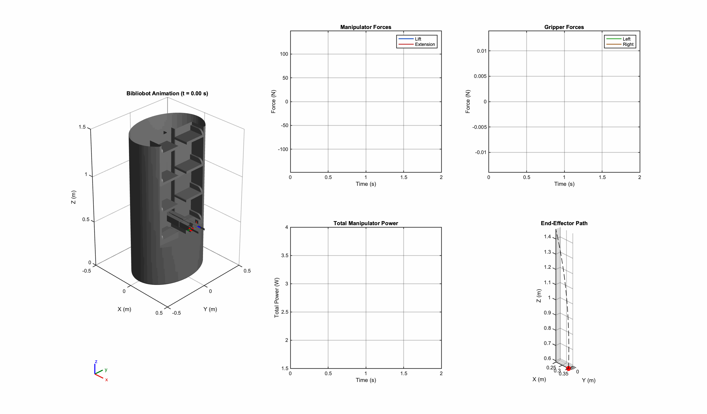
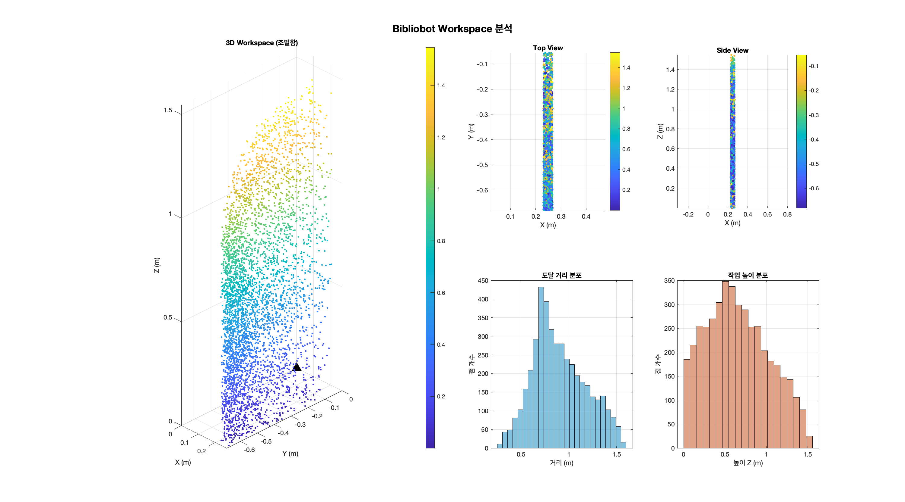
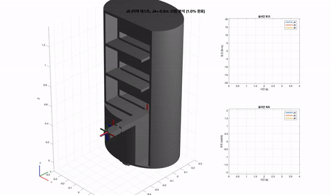
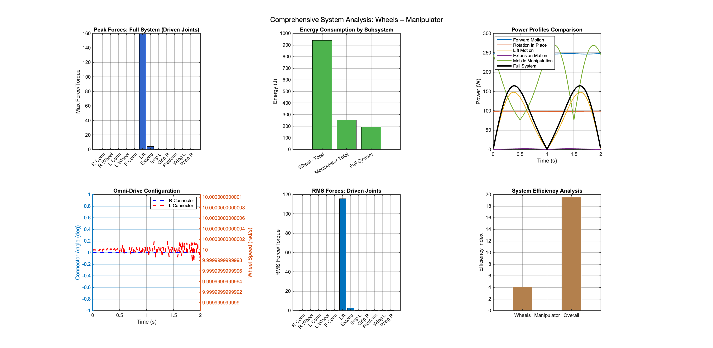
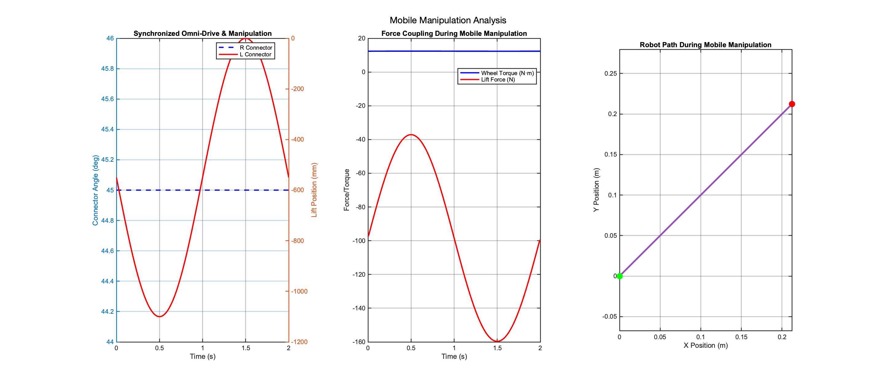
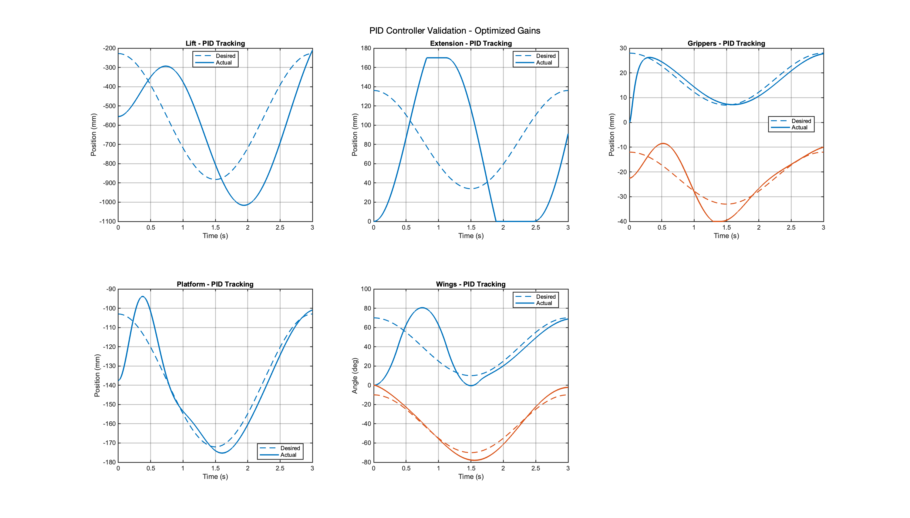
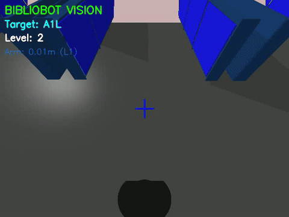

# 📚 Bibliobot

### An Autonomous Library Book-Retrieval Mobile Manipulator

*An omni-drive mobile robot that navigates a library by shelf code, plans safe paths, sequences multiple stops, and drives a telescoping manipulator to shelf height — simulated end to end in PyBullet, tuned in MATLAB.*



`PyBullet` · `A* Planning` · `Multi-Shelf Sequencing` · `Inverse Kinematics` · `MATLAB PID` · `MediaPipe Pose` · `Fusion 360 URDF`

*Human Robotics (MEU5059) · Yonsei University · Spring 2025*

---

## TL;DR

Fetching a book is a full mobile-manipulation problem — the robot has to know where a shelf is, drive there without hitting anything, face it correctly, raise a manipulator to the right height, and do that for several books in a sensible order. Bibliobot is a from-scratch robot that does all of this in simulation. It carries an omni-drive base and a multi-stage telescoping manipulator, navigates a coded library layout with A* path planning under safety margins, optimizes the order of multi-shelf visits, and reaches each shelf level with a manipulator whose motion is solved with inverse kinematics and whose dynamics and PID gains were tuned and validated in MATLAB.

> Shelf code in → planned, safe, ordered retrieval out.

---

## System overview

| Layer | What it does | Where |
| --- | --- | --- |
| **Task planning** | Optimizes the visit order for a set of requested shelves | `sim/library_navigation.py` |
| **Path planning** | A* / Manhattan grid search with safety margins and path simplification | `planning/trajectory_planner.py`, `sim/` |
| **Motion & IK** | Omni-drive base control with orientation, inverse kinematics for the manipulator, per-joint and coordinated motion | `sim/library_navigation.py` |
| **Low-level control** | Joint dynamics, PID gain grid-search tuning and validation | `analysis/` |
| **Perception** | MediaPipe-Pose tracking camera that follows a target | `vision/pose_follow.py`, `media/vision_tracking/` |
| **Robot model** | Fusion 360 design exported to URDF with STL meshes | `urdf/`, `cad/` |

---

## The robot

Bibliobot is modeled in Autodesk Fusion 360 and exported to a URDF the simulator loads directly. The platform pairs a three-wheel omni-drive base with a multi-stage slider manipulator and a parallel-jaw end-effector, so the base handles gross positioning across the library while the manipulator handles vertical reach and the grip handles the book. The mesh set in `urdf/meshes/` covers the base, the wheel and connector assemblies, the telescoping slider stages, the platform wings, and the two end-effector jaws. The earlier prototype design is preserved under `docs/prototype/`.



---

## Motion, IK, and dynamics

Every axis is driven through inverse kinematics rather than scripted poses, so the manipulator is commanded by target position and the joint angles are solved for. The clip below is a single joint-IK sweep; the full set of per-joint sweeps and coordinated whole-robot motions lives in `media/`.



- **Per-joint IK** (`media/joint_ik/`) — lift (J4), extend (J5), wrist (J6), and gripper (J78) sweeps
- **Single-axis dynamics** (`media/ik_dynamics/`) — forward, lateral, lift, extension, gripper, wing, platform, and rotation-in-place motions, each isolated
- **Coordinated motion** (`media/whole_robot/`) — base and manipulator moving simultaneously, and the full book-retrieval sequence
- **Full walkthroughs** (`media/overview/`, `media/gui/`) — complete simulator runs



---

## Navigation and planning

The library is a coded grid of shelves, each with an approach pose on the correct side of an aisle. Given one or more requested shelf codes, Bibliobot:

1. Optimizes the **visit order** across the requested shelves so the total route is short rather than served first-come.
2. Plans a path to each approach pose with **A\*** over a grid, keeping a safety margin around shelves and walls, then simplifies the path to the fewest waypoints.
3. Follows the route on the **omni-drive base** with explicit orientation control, rotating in place to face the shelf before reaching.
4. Raises the manipulator to the target **shelf level** and extends to the book.

The standalone `planning/trajectory_planner.py` runs the A* planner on its own with a matplotlib view of the library, the chosen route, and the path history, which is the easiest way to see the planner behave without the full physics loop.



---

## Control and dynamics

The manipulator's behavior is not hand-waved. The MATLAB suite in `analysis/` derives the joint dynamics, tunes PID gains with a grid search over the gain space, and then validates the tuned controller across the range of motion, which is what lets the simulated joints track their targets cleanly rather than oscillate. Optimized gain sets and analysis outputs are saved under `analysis/data/`, and the generated figures under `analysis/figures/`.

- `BibliobotAnalysis.m` — dynamics and workspace analysis
- `BibliobotPIDAnalysis.m` — controller analysis
- `BibliobotPIDAnalysisGridSearch.m` — PID gain grid search
- `BibliobotPIDValidation.m` — validation of the tuned gains



---

## Perception

`vision/pose_follow.py` is the tracking-camera module, built on **MediaPipe Pose** (`pose_landmarker_lite`). It locks onto a person, uses shoulder width as a relative-distance proxy, and emits forward / backward / yaw commands to keep the target framed. Recorded runs are in `media/vision_tracking/`. It is a self-contained tracking prototype rather than a module wired into the navigation stack. The model file downloads automatically on first run.



---

## Repository layout

```
bibliobot-Human-Robotics-2025/
├── sim/
│   ├── library_navigation.py     # PyBullet sim: task + path planning + drive + IK manipulation
│   └── hello_bullet.py           # minimal URDF loader / sanity check
├── planning/
│   └── trajectory_planner.py     # standalone A* library planner + matplotlib visualization
├── vision/
│   └── pose_follow.py            # MediaPipe-Pose tracking camera
├── urdf/
│   ├── Bibliobot.urdf            # robot description (references meshes/)
│   └── meshes/                   # STL meshes
├── analysis/
│   ├── *.m                       # MATLAB dynamics + PID tuning and validation
│   ├── figures/                  # generated analysis figures
│   └── data/                     # optimized PID gains + analysis .mat outputs
├── cad/                          # Autodesk Fusion 360 source (final + prototype)
├── media/
│   ├── vision_tracking/          # tracking-camera recordings
│   ├── joint_ik/                 # per-joint inverse-kinematics sweeps
│   ├── ik_dynamics/              # isolated single-axis motions
│   ├── whole_robot/              # coordinated base + arm, book retrieval
│   ├── gui/                      # simulator GUI recordings
│   └── overview/                 # full walkthroughs
├── docs/
│   ├── slides/                   # final presentation
│   └── prototype/                # earlier prototype URDF + meshes
└── assets/                       # figures and previews for this README
```

---

## Quickstart

```bash
# 1. Install dependencies
pip install pybullet numpy opencv-python matplotlib mediapipe

# 2. Run the full library-navigation simulation (opens a PyBullet GUI)
python sim/library_navigation.py

# 3. Run the standalone A* path planner (matplotlib)
python planning/trajectory_planner.py

# 4. Run the tracking camera (needs a webcam; model auto-downloads on first run)
python vision/pose_follow.py

# 5. Control tuning (MATLAB)
#    run analysis/BibliobotAnalysis.m, then
#    analysis/BibliobotPIDAnalysisGridSearch.m -> analysis/BibliobotPIDValidation.m
```

> The simulation resolves the URDF relative to `sim/` (`../urdf/Bibliobot.urdf`), and PyBullet loads the meshes from `urdf/meshes/`, so it runs from a fresh clone with no path edits.

---

## Stack

| Component | Choice |
| --- | --- |
| Simulation | PyBullet |
| Path planning | A* + Manhattan grid, safety margins, path simplification |
| Task planning | multi-shelf visit-order optimization |
| Manipulation | inverse kinematics |
| Control tuning | MATLAB PID grid search and validation |
| Perception | MediaPipe Pose (`pose_landmarker_lite`) + OpenCV |
| CAD / model | Autodesk Fusion 360 → URDF + STL |

---

## Media

All demo recordings are compressed mp4 under `media/`, grouped by joint-IK sweeps, isolated dynamics, coordinated motion, tracking camera, GUI runs, and full walkthroughs. The final course presentation is at `docs/slides/Bibliobot_Final_Presentation.pptx`.

---

## Team

Team project for **Human Robotics (MEU5059)**, Yonsei University, Spring 2025.
